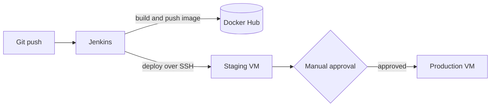

<div align="center">

# Travel App: Containerized and Shipped with CI/CD

**A PHP + PostgreSQL travel website, packaged with Docker and deployed through a Jenkins pipeline to staging and production VMs.**


</div>

---

## Why I built this

I wanted to learn DevOps by doing it end to end, not by following a tutorial. So instead of just running a website on my laptop, I treated it like a real product: package it, automate the release, test it on a staging server, and only then promote it to production.

Everything runs in a home lab: a VMware setup on my Linux machine with two separate VMs, one for **staging** and one for **production**. Because it lives on a private network, the site isn't publicly reachable.

## How it works



Every release is tagged with the Jenkins build number (`travel-app:v<build>`), so each version is traceable and rolling back is as simple as redeploying an older tag.

## The pipeline

The [`Jenkinsfile`](./Jenkinsfile) defines five stages:

| # | Stage | What happens |
|---|-------|--------------|
| 1 | **Build & Push** | Builds the Docker image, tags it with the build number, and pushes it to Docker Hub |
| 2 | **Create Environment File** | Generates the `.env` file at deploy time, with the database password pulled from Jenkins credentials |
| 3 | **Deploy to Staging** | Copies the Compose files to the staging VM over SSH, pulls the new image, and recreates the containers |
| 4 | **Approval Gate** | The pipeline pauses until I verify staging and click to promote |
| 5 | **Deploy to Production** | Repeats the same deployment on the production VM |

Secrets (Docker Hub login, SSH key, database password) are stored in Jenkins credentials. None of them live in this repo.

## Tech stack

| Layer | Tool |
|-------|------|
| App | PHP 8.2 on Apache |
| Database | PostgreSQL 16 |
| Containers | Docker, Docker Compose |
| CI/CD | Jenkins, Docker Hub |
| Infrastructure | VMware, Linux VMs (staging and production) |

## Project structure

```
.
├── src/                  # PHP application (served by Apache)
├── db/
│   └── init.sql          # Database schema, loaded on first start
├── Dockerfile            # PHP 8.2 + Apache + Postgres driver
├── docker-compose.yml    # web + db services on a private network
├── Jenkinsfile           # CI/CD pipeline
├── .env.example          # Template for required environment variables
└── .gitignore
```

## Design decisions

- **One image for the app.** PHP and Apache ship together, with the Postgres driver (`pdo_pgsql`) installed, and the apt cache cleaned in the same layer to keep the image small.
- **The database is private.** Postgres isn't exposed to the network. Only the web container can reach it over the Compose network.
- **Data survives restarts.** Database files live in a named volume, and the schema loads automatically from `init.sql`.
- **Automatic recovery.** Services use `restart: unless-stopped`, so they come back after a crash or reboot.
- **Staging before production.** Every change is checked on staging first, and production needs a deliberate click.

## Run it locally

You'll need Docker and Docker Compose.

```bash
# 1. Clone the repo
git clone https://github.com/SYED-SUMAID/Travel-app-compose2.git
cd Travel-app-compose2

# 2. Create your environment file
cp .env.example .env
# then edit .env and set your own values

# 3. Build the image
docker build -t <your-dockerhub-user>/travel-app:v1 .

# 4. Start everything
export DOCKER_USER=<your-dockerhub-user>
export TAG=1
docker compose up -d
```

Then open **http://localhost:8090**.

Required values in `.env`:

```
POSTGRES_DB=travel_db
POSTGRES_USER=postgres
POSTGRES_PASSWORD=choose-a-strong-password
```

## What I learned

- Staging catches mistakes before real users ever see them
- Versioned images make releases traceable and rollbacks simple
- Secrets belong in a credential store, never in Git
- Automating a deployment once saves hours of repeating it by hand

## What I'd improve next

- [ ] Add a Postgres `healthcheck` so the web container waits until the database is truly ready
- [ ] Add a `.dockerignore` and run the container as a non-root user
- [ ] Add automated tests as a pipeline stage before deployment
- [ ] Move host details out of the Jenkinsfile and into Jenkins parameters

## About me

I'm **Sumaid**, building my skills in Linux, DevOps and automation, and looking for an entry-level DevOps role or internship. If you have feedback on this setup, I'd love to hear it.

- GitHub: [@SYED-SUMAID](https://github.com/SYED-SUMAID)
- LinkedIn: [Syed Sumaid Altaf](https://www.linkedin.com/in/syed-sumaid-altaf-b4ab72388)
